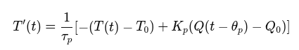

# PID -> Offline RL(IQL) -> Online RL(IQL)

RL이 실제 제어 환경에서도 잘 동작하는지 확인하고자 합니다.

실제 환경과 상호작용하며 Online RL을 진행하기에는 코스트(시간)소모가 큽니다.​

전통적인 제어 방식(PID)을 폐루프 제어의 제어요소로 사용하여 데이터를 수집합니다. ​

수집한 데이터를 이용하여 Offline pre-train을 진행​합니다.

환경과 상호작용하며 적은 데이터로 Online Tuning을 진행합니다.

실험 환경은 TCLab을 기반으로 실험을 진행합니다.​

PID와 RL 모델의 결과를 비교합니다.

# 개요
1. 실제 TCLab 키트 상에서 Tsp를 적절히 설정하고, PID 제어를 통해 데이터를 수집​

2. 해당 데이터를 통해 Offline IQL을 진행

3. 시뮬레이터를 활용하여 성능이 향상되는 Online IQL에 대한 다양한 방법론을 실험​

4. 찾은 방법론을 키트에 적용하여 Online IQL을 시행​

5. 키트에서 최종 평가를 진행하여 성능을 측정

# TCLab (Temperature Control Lab)

- 공식 사이트: [APMonitor Arduino Temperature Control](https://apmonitor.com/pdc/index.php/Main/ArduinoTemperatureControl)

TCLab은 **2개의 히터**와 **2개의 온도 센서**로 구성되어, 실제 **열 제어 시스템을 소형 실험실 환경**에서 모사할 수 있는 장비입니다.  
목표는 **히터 출력을 조절하여 원하는 온도를 따라가는 것**이며, 히터 출력은 **0~100%의 실수**로 조절 가능합니다.  

> ❄️ 냉각 시스템은 내장되어 있지 않으며, **자연 냉각(외부 온도)**에 의존합니다.

---

#  실험 순서

## 1. Arduino & TCLab 환경 설정

- 아두이노 연결 및 라이브러리 설치는 다음 공식 깃허브를 참고하세요:  
  👉 [Getting Started with TCLab](https://github.com/APMonitor/arduino/blob/master/gettingStarted.md)

---

## 2. PID & MPC Control 데이터 수집

### 2 - 1 PID

경로: `data_collect/PID_control/PID_data_collect.ipynb`

다음 4단계를 통해 데이터를 수집하고 모델을 추정합니다.

---

#### 📌 Step 1. 지연 시스템(FOPDT) 모델을 위한 데이터 수집

FOPDT 모델은 현실의 많은 동적 시스템을 간단하고 효과적으로 근사하는 데 사용​

PID 계수를 측정하기 위하여 제어 대상의 모델 정보가 필요​

수집된 시계열 데이터를 바탕으로 시스템을 FOPDT모델 근사​하기 위하여 Heater Q1, Q2에 대해 여러 구간의 스텝 입력을 주입하여 데이터 수집​

- **결과**: `data.csv` (Q1/Q2 입력, T1/T2 출력)

---

#### 📌 Step 2. FOPDT 모델 파라미터 추정
수집된 시계열 데이터를 바탕으로 시스템을 FOPDT모델 근사​

    𝑦(𝑡): 시스템 출력​

    𝑢(𝑡): 입력 (예: 밸브 개도, 히터 전력 등)​

    Kp​ : 프로세스 이득 (입력의 변화가 출력에 미치는 영향)​

    𝜏𝑝 : 시간 상수 (시스템이 얼마나 빠르게 반응하는지)​

    𝜃𝑝​ : 지연 시간 (입력이 변할 때 출력에 영향까지의 지연 시간)
- **추정 기법**: `scipy.optimize.minimize` + 수치 적분 (`odeint`)  
- **결과**: 모델 파라미터 → `fopdt.txt` 저장

    
---

#### 📌 Step 3. PID 파라미터 추정

- **튜닝 방식**:  
  - ITAE 기반 PI 튜닝  
  - IMC 기반 PID 튜닝  
- **결과**: `Kc`, `tauI`, `tauD`, `Kff` 도출  
- **시뮬레이션 확인**:  
  - 슬라이더 인터페이스(`ipywidgets`)로 실시간 튜닝 실험  
  - 모델 기반 온도 응답 확인 가능

---

#### 📌 Step 4. PID 제어 기반 강화학습 데이터 수집

- **실제 기기 적용**:  
  - 튜닝된 PID로 히터 제어  
  - 다양한 목표 온도(TSP1, TSP2) 시나리오 적용

  ---

### 2 - 2. Model Predictive Control (MPC) 방식

**MPC** 방식을 사용하여 온도를 제어합니다.  
MPC는 **모델 기반의 최적화 제어기**로, 현재 상태에서 **미래를 예측하고, 최적의 제어 입력을 계산**하는 것이 핵심입니다.

경로: `data_collect/MPC_control/MPC_data_collect.py`

#### 🔧 작동 방식 요약

1. **현재 온도 측정**
   - 센서로부터 `T1`, `T2`를 읽어 현재 상태를 파악합니다.

2. **목표 온도 전달**
   - `TSP1`, `TSP2`를 deadband(±0.1℃)를 포함하여 APMonitor에 전달합니다.

3. **미래 예측 및 최적화 수행**
   - 서버에서는 시스템 모델(FOPDT 등)을 사용하여 향후 온도 변화 예측
   - 미래 일정 시간 동안의 온도가 목표에 근접하도록 최적의 히터 출력(Q1, Q2)을 계산합니다.

4. **히터 제어**
   - 계산된 Q1, Q2를 실제 히터에 출력하여 온도를 제어합니다.

> ✅ 이 최적화는 `APMonitor` 서버에서 매 제어 주기마다 실시간으로 수행됩니다.

---

#### 제어 원리 (MPC의 핵심)

MPC는 다음 최적화 문제를 반복적으로 풉니다:

minimize over Q1, Q2:
    sum_{k=0}^{N} [ (T1_k - TSP1_k)^2 + (T2_k - TSP2_k)^2 + penalty terms ]

---

#### 구성 파일 및 설정 정보

- **모델 파일**: `MPC_control/control.apm`  
- **데이터 파일**: `MPC_control/control.csv`

---

### 2 - 3. Model Predictive Control (MPC) 방식

경로: `data_collect/pid_mpc_data_collect.py`

PID와 MPC 데이터를 동시에 수집합니다.

**단, PID 데이터 수집을 위해서 앞선 2-1 단계를 거쳐 PID파라미터를 구해놓아햐 합니다.**

- **수집 데이터**:  
  - 상태: 온도(T1, T2)  
  - 행동: 히터 출력(Q1, Q2)  
  - 목표: TSP1, TSP2  
  - 보상 지표: IAE 등  
  - 저장 형식: CSV (`PID_episode_*.csv`)

- 각 에피소드 결과는 다음 형식으로 저장됩니다:
  - **CSV**: 
  
        /data/PID_MPC/PID/csv/PID_episode_*.csv
        /data/PID_MPC/MPC/csv/MPC_episode_*.csv

  - **그래프(PNG)**:

        /data/PID_MPC/PID/csv/PID_episode_*.png
        /data/PID_MPC/MPC/csv/MPC_episode_*.png

## 3. Offline Reinforcement(IQL)

다음의 깃허브를 참조하여 구현되었습니다. https://github.com/gwthomas/IQL-PyTorch

PID, MPC로 수집된 데이터를 통해 IQL을 Offline 훈련시킵니다.

경로: `/make_offline_data.ipynb`

다음 노트북을 실행시켜 offline 훈련에 사용될 데이터를 생성합니다.
자세한 실험 정리와 코드를 확인할 수 있습니다.

### 실험 1
- 상태: T1, T2, TSP1, TSP2 
- 액션: Q1, Q2
- 보상: 목표온도 - 측정온도

### 실험 2
- 상태: T1, T2, TSP1, TSP2 
- 액션: Q1, Q2
- 보상: 목표온도(t+1) - 측정온도(t+1)

### 실험 3

- 상태: T1, T2, TSP1, TSP2 
- 액션: Q1, Q2

- 보상:  PBRS(Potential-Based Reward Shaping) 적용 

  -> Φ(t) = -‖T_t - TSP_t‖

  -> rt=0 //개선정도만이 보상의 척도가 됨.

  -> reward_t = rt + γ * Φ(t+1) - Φ(t) 
